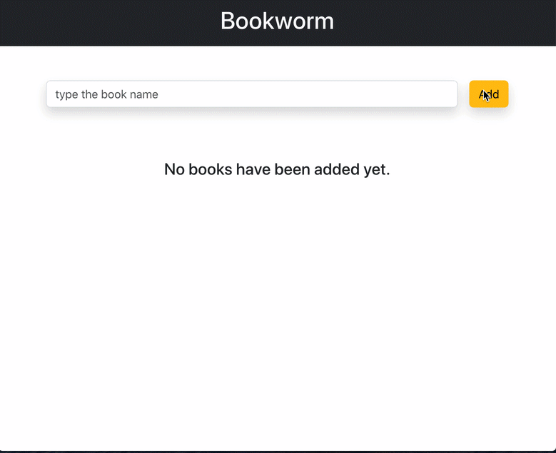

# React Crud App

- The application is designed for users to manage their books.
- Users can add books, edit book details, mark books as read or as unread and delete books.

### Technologies

- JavaScript with the React framework

### `Screen`

